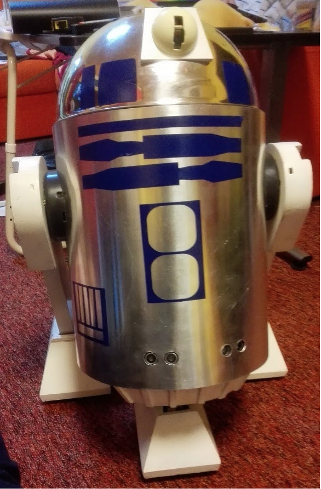

# Artík: R2D2-like robot on Raspberry Pi

This repository accompanies my Bachelor Thesis where I developed a home-made robot, whom I call "Artík".



The robot was inspired by R2D2 from Star Wars. It uses legs to move around, and swivels its head and eye to look around.

The robot can also record a video from its camera, say things with text-to-speech, detect obstacles using ultrasound, and a number of other things (see my thesis for full details, in Czech).

## Installation

Installation assumes you already have the robot built and can access its Raspberry Pi microcomputer via SSH:

1. (build the robot)
2. Export this repository to `/home/pi/Artik`
3. Run `bash /home/pi/Artik/install_artik.sh` to all install dependencies and supporting libraries
4. Run `python3 -m artik.server.py $/home/pi/Artik/data` to launch its API (HTTP server)

## Controls

The robot runs an internal HTTP web server. You can control its actions through a web API. Recognized commands:

* `POST /say`: Say some text, using text-to-speech. The text to say is defined in the request JSON payload.
* `POST /walk`: Move robot's legs. Each leg can move with a different speed (including negative = reverse). The leg speeds are defined in the request JSON payload.
* `POST /turn_head`: Move robot's head. The head moves only horizontally (left-to-right), with the desired angle and rotation speed defined in the request JSON payload.
* `POST /swivel_eye`: Move the robot's eye. The eye moves up-and-down on the head, with the desired angle and swivel speed defined in the request JSON payload.
* `POST /play`: Play sound or music. The sound to play is defined in the request JSON payload. Supported formats are MP3, OGG and WAV.
* `POST /project`: Display video on the robot's LCD projector. The video to play is taken from the robot's internal SD card.
* `POST /record_video`: Record a video from the robot's camera(s) and store it to robot's internal disk. The desired video duration and which camera to record from are defined in the request JSON payload.
* `POST /snapshot`: Capture a JPEG image from one of a robot's camera.
* `POST /fold_legs`: Fold the robot's third leg, R2D2-style.
* `GET /status`: Return the robot's state and health.

To control Artík remotely, connect the Raspberry Pi's wifi and issue a command to its IP address, port 8080:

```bash
curl -XPOST http://192.168.1.60:8080/say -H 'Content-Type: application/json' -d'{"text": "Hello world."}'
```

You configure a different interface or port inside `data/artik.conf`.

---

This code is released under GNU GPL v2. Copyright (c) 2020 Jan Vacek.
